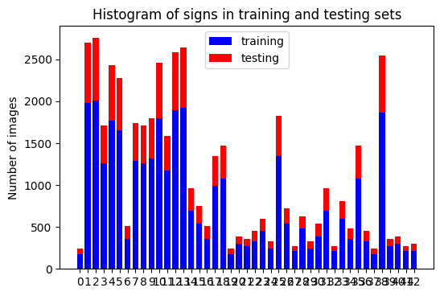

# Traffic Sign Recognition 

## Kemal Tepe, ketepe@gmail.common

### Objective: To build a traffic sign recognition architecture using convolutional neural networks (CNN) which can achieve 93% or more accuracy with given German road sign dataset.


### Summary:

The starting point for this project was to use Lenet-5 CNN architecture what we have learned in the Udacity Self Driving Nano-Degree (carND). Original architecture was to recognize hand written numbers. However, here we need to recognize road signs. There are more signs, 43 signs, compared to number 0-9. The rest of the document explains steps taken to complete the task. The architecture provided in this folder can recognize signs with 94-96% accucary, which exceeds the required 93%.

### Lay out of the report:

0. Set up the important libraries and imports for rest of the program such as tensorflow, pandas, numpy.
1. Load the data set 
2. Explore, summarize and visualize the data set
3. Design, train and test a model architecture
4. Use the model to make predictions on new images
5. Summarize the results with a written report
6. Stand Out Suggestions

The entire code can be obtained using [here](./P2_KemalTepe.ipynb). The data set must be downloaded from [German Traffic Sign Dataset](http://benchmark.ini.rub.de/?section=gtsrb&subsection=dataset), and must be unzipped in a directory *trafic-signs-data* prior to running the code. Now we will go to important parts of the steps of the code.


#### 0. Set up the libraries

```python
import pickle
import matplotlib.pyplot as plt
import random
import pandas as pd
import numpy as np
import tensorflow as tf
from sklearn.utils import shuffle
from tensorflow.contrib.layers import flatten
```

#### 1. Load the data set

The code comments provides details about the set and how they are loaded.

```python
#Reading the training, validation and testing data 
#stored in the subfolder "traffic-signs-data" folder
training_file = './traffic-signs-data/train.p'
validation_file='./traffic-signs-data/valid.p'
testing_file = './traffic-signs-data/test.p'

with open(training_file, mode='rb') as f:
    train = pickle.load(f)
with open(validation_file, mode='rb') as f:
    valid = pickle.load(f)
with open(testing_file, mode='rb') as f:
    test = pickle.load(f)
    
X_train, y_train = train['features'], train['labels']
X_valid, y_valid = valid['features'], valid['labels']
X_test, y_test = test['features'], test['labels']

```
#### 2. Exploratory visualization of the dataset and identify

The following code obtains necessary information such as size of the data set, shape to be used in the previous sections. The labels are also correctly identified.

```pyhton
#Number of training examples
n_train = len(X_train)

#Number of testing examples.
n_test = len(X_test)

#the shape of an traffic sign image
image_shape = X_train[0].shape

#How many unique classes/labels there are in the dataset.
n_classes = len(train)

print("Number of training examples =", n_train)
print("Number of testing examples =", n_test)
print("Image data shape =", image_shape)
print("Number of classes =", n_classes)

```

The output for this part was: 

```
Number of training examples = 34799
Number of testing examples = 12630
Image data shape = (32, 32, 3)
Number of classes = 4
```
Histgram of training and testing data sets is provided in Figure below.



#### 3. Design and Test a Model Architecture

##### 3.1. Architecture

ArtThe Lenet architecture is used in the project. Before setting up the architecture, I have reviewed few key papers in the area and the following two were the most useful: [[1]](./sermanet-ijcnn-11.pdf) by Sermanet et al. and [[2]](./lenet_chalmers.pdf) by Credi. Credi in [2] has also used Lenet to comprate his own architecture for road sign clasification. The crucial point in the Lenet for this tasks was to identify parameters such as number of hidden nodes in the layers and convolutional filter dimensions. After extensive trials of these parameters, the following architecture was constructed. 

|Table 1: Architecture | | |
|---------|--------|--------|
|Layer | Description | Parameters |
|Layer 1| CNN 5x5x1 | input=32x32x1 output=28x28x48|
|Pooling | 2x2x1 Max | input=28x28x1 output=14x14x1 |
| Activation| ELU| |
|Layer 2| CNN 5x5x1 | input=14x14x48 output=10x10x96|
|Pooling | 2x2x1 Max | input=10x10x1 output=5x5x1 |
| Activation| ELU| |
|Layer 3| fully connected | input=5x5x96 output=140|
| Activation| ELU| |
|Layer 4| fully connected | input=140 output=96|
| Activation| ELU| |
|Layer 5| fully connected | input=96 output=43|
|logits| output=43| |

The full Lenet code is given below:

```python
#my convolutional NN architecture. 
#it is derived from Lenet 5 architecture, 
#but optimized by using number of hidden nodes for the traffic sign clasification 

def LeNet(x):    
    # Arguments used for tf.truncated_normal, randomly defines variables for the weights and biases for each layer
    mu = 0
    sigma = 0.03 # hyperparameter for noise
    #set up the number of nodes between the layers
    w1nodes=48 # number of conv hidden nodes in the conv NN in the layer 1
    w2nodes=96 # number of conv hidden nodes in the conv NN in the layer 2 
    w3nodes=5*5*w2nodes #number of fully connected nodes in layer 3 and flattening 
    w4nodes=140 #number of fully connected nodes in layer 4
    w5nodes=96 #number of fully connected nodes in Layer 5
    outputnodes=43 #number of output nodes, since there are 43 signs in the data set.
    
    # SOLUTION: Layer 1: Convolutional. Input = 32x32x1. Output = 28x28x(w1nodes).
    conv1_W = tf.Variable(tf.truncated_normal(shape=(5, 5, 1, w1nodes), mean = mu, stddev = sigma))
    conv1_b = tf.Variable(tf.zeros(w1nodes))
    conv1   = tf.nn.conv2d(x, conv1_W, strides=[1, 1, 1, 1], padding='VALID') + conv1_b

    # SOLUTION: Activation.
    #instead of RELU, i used ELU non-linear function
    conv1 = tf.nn.elu(conv1)

    # SOLUTION: Pooling. Input = 28x28x(w1nodes). Output = 14x14x(w1nodes).
    conv1 = tf.nn.max_pool(conv1, ksize=[1, 2, 2, 1], strides=[1, 2, 2, 1], padding='VALID')

    # SOLUTION: Layer 2: Convolutional. Output = 10x10x(w2nodes).
    conv2_W = tf.Variable(tf.truncated_normal(shape=(5, 5, w1nodes, w2nodes), mean = mu, stddev = sigma))
    conv2_b = tf.Variable(tf.zeros(w2nodes))
    conv2   = tf.nn.conv2d(conv1, conv2_W, strides=[1, 1, 1, 1], padding='VALID') + conv2_b
    
    # SOLUTION: Activation.
    conv2 = tf.nn.elu(conv2)

    # SOLUTION: Pooling. Input = 10x10x1(w2nodes) Output = 5x5x(w2nodes).
    conv2 = tf.nn.max_pool(conv2, ksize=[1, 2, 2, 1], strides=[1, 2, 2, 1], padding='VALID')

    # SOLUTION: Flatten. Input = 5x5x(w2nodes). Output = w3nodes.
    fc0   = flatten(conv2)
    
    # SOLUTION: Layer 3: Fully Connected. Input = w3nodes Output = w4nodes
    
    fc1_W = tf.Variable(tf.truncated_normal(shape=(w3nodes, w4nodes), mean = mu, stddev = sigma))
    fc1_b = tf.Variable(tf.zeros(w4nodes))
    fc1   = tf.matmul(fc0, fc1_W) + fc1_b
    
    # SOLUTION: Activation.
    fc1    = tf.nn.elu(fc1)

    # SOLUTION: Layer 4: Fully Connected. Input = w4nodes Output = w5nodes

    fc2_W  = tf.Variable(tf.truncated_normal(shape=(w4nodes, w5nodes), mean = mu, stddev = sigma))
    fc2_b  = tf.Variable(tf.zeros(w5nodes))
    fc2    = tf.matmul(fc1, fc2_W) + fc2_b
    
    # SOLUTION: Activation.
    fc2    = tf.nn.elu(fc2)

    # SOLUTION: Layer 5: Fully Connected. Input = w5nodes Output = outputnodes.
    
    fc3_W  = tf.Variable(tf.truncated_normal(shape=(w5nodes, outputnodes), mean = mu, stddev = sigma))
    fc3_b  = tf.Variable(tf.zeros(outputnodes))
    logits = tf.matmul(fc2, fc3_W) + fc3_b
    
    return logits


```

##### 3.2. Training, validating and testing setup

After the architecture set up. The training and evaluation modules are set up as follows:

```python
# setup the training parameters
#original rate = 0.001 
rate=0.001
EPOCHS = 20
BATCH_SIZE = 128
print('learning rate', rate, 'Epoch', EPOCHS, 'Batch Size', BATCH_SIZE)

# setup tensors to be feed at each epoch
x = tf.placeholder(tf.float32, (None, 32, 32, 1))
y = tf.placeholder(tf.int32, (None))
one_hot_y = tf.one_hot(y,43)

# Train your model here.
#set up the system
logits = LeNet(x)
cross_entropy = tf.nn.softmax_cross_entropy_with_logits(logits=logits, labels=one_hot_y)
loss_operation = tf.reduce_mean(cross_entropy)
optimizer = tf.train.AdamOptimizer(learning_rate = rate)
training_operation = optimizer.minimize(loss_operation)

#Evaluate how well the loss and accuracy of the model for a given dataset.
correct_prediction = tf.equal(tf.argmax(logits, 1), tf.argmax(one_hot_y, 1))
accuracy_operation = tf.reduce_mean(tf.cast(correct_prediction, tf.float32))
saver = tf.train.Saver()

```

##### 3.3. Training, validating and testing

With the training setup, the tensorflow session was run with the following code to obtain a model with training, and validate the model with validation set.
```python
### Calculate and report the accuracy on the training and validation set.
### Once a final model architecture is selected, 
### the accuracy on the test set should be calculated and reported as well.
with tf.Session() as sess:
    sess.run(tf.global_variables_initializer())
    num_examples = len(X_train)
    
    print("Training...")
    print()
    for i in range(EPOCHS):
        X_train, y_train = shuffle(X_train, y_train)
        for offset in range(0, num_examples, BATCH_SIZE):
            end = offset + BATCH_SIZE
            batch_x, batch_y = X_train[offset:end], y_train[offset:end]
            sess.run(training_operation, feed_dict={x: batch_x, y: batch_y})
            
        validation_accuracy = evaluate(X_valid, y_valid)
        print("EPOCH {} ...".format(i+1))
        print("Validation Accuracy = {:.3f}".format(validation_accuracy))
        print()
        
    saver.save(sess, './lenet')
    print("Model saved")
```
The output was given like: 
```
Training...
EPOCH 1 ...
Validation Accuracy = 0.908
EPOCH 2 ...
Validation Accuracy = 0.922
EPOCH 3 ...
Validation Accuracy = 0.936
.....
EPOCH 18 ...
Validation Accuracy = 0.947
EPOCH 19 ...
Validation Accuracy = 0.941
EPOCH 20 ...
Validation Accuracy = 0.924

Model saved
```

Finally the testing session was run with the following code on the test data:

```python
#test accucary

with tf.Session() as sess:
    saver.restore(sess, tf.train.latest_checkpoint('.'))

    test_accuracy = evaluate(X_test, y_test)
    print("Test Accuracy = {:.3f}".format(test_accuracy))

```
Final testing accuracy is:
```
Test Accuracy = 0.923
```
However, this changes at each run and fluctuates between 95-92%


#### 4. Use the model to make predictions on new images

The trained and validated model was used with 5 new images which were obtained from the internet. I downloaded German road sign images and cropped the sections which have the signs, then scaled to 32x32 pixel jpeg files. The signs are given below, also in the directory [roadsing](./roadsigns):

+ no entry
+ pedestrian
+ speed limit 30
+ stop 
+ yield

The succes rate on the trained model with these images were 80-100%. For this limited set, 80% was quite good, the possible causes for error are skewed images, loss of information during the scaling and cropping. The success of the model in the test set provided in the original data set is around 95-92%. However the success rate of the newly acquired images were 80-100%. 

In the last run the model achieved 100% accuracy.

```
Internet Road Sign Accuracy = 1.000
```


#### 5. Summarize the results with a written report and Conclusions

Lenet-5 CNN architecture was found to be very robust and versatile. I have tried a number of different combinations to achieve the required accuracy of 93%. Two documents that I have extensively used are [1](./sermanet-ijcnn-11.pdf) by Sermanet et al. and [2](.\lenet_chalmers) by Credi. Particularly Credi in [2] helped me understand impact of different parameters while tuning them for the desired accuracy. That is why I have selected hidden layers such as 48->96->140->96->43. When we increase the number of  some of the hidden layers, accuracy improved but it took longer to train and construct the model. The above achitecture seems to be quite good in accuracy and level of computational complexity. 

+ The final accuracy of the model is around 94-96%.
+ The learningrate 0.001-0.0005 seems to be ideal and for final run 0.001 was used.
+ The noise variance in the Lenet has also had an impact and 0.03 seems to be yielding good results. 

CNN is very versatile and can be optimized with number of different ways to obtain required accuracy and computational complexity. 


#### 6. Stand Out Suggestions

+ In this architecture we used only grayscale images. If color, which contains alot of information, is included in the model, the acuracy would be much higher. I came accross such architectures to utilize color and they seem to be providing better accuracy compared to only gray models.

+ Another improvement could be adaptive learning rate. A fixed learning rate causes fluctuations when the model approaches to its optimal point. The accuracy in the last 6-10 epoch seems to be oscilating around the optimum. If we were to reduce the learning rate at that time, the model would settle on the optimum instead of oscilating around it.

+ I have not done any thorough optimization of number of hidden nodes at leach layer. This can be done using more runs with set of parameters to achieve 96-99% accuracy. Especially combined with color, i anticipate the accuracy can be increased to 98-99% range.


#### EOF

